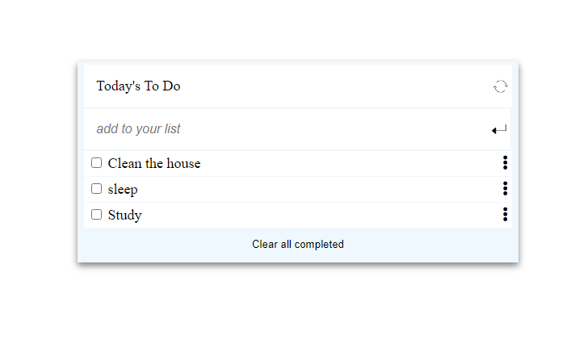

# ToDoList

> The aim of the project is to create a to do list and use webpack to bundle Javascript.

## Project objectives.
- Use webpack to bundle JavaScript.
- Practice how to use proper ES6 syntax.
- Use ES6 modules to write modular JavaScript.
- Write a function to render dynamically created list of tasks in the dedicated placeholder. 
- Load CSS using webpack Style/CSS Loader

## Built With

- HTML/CSS
- JavaScript
- webpack

## Live Demo

[Live Demo Link](https://lichapa.github.io/ToDoList/dist/)

## Getting Started

> Visit my [repository](https://github.com/Lichapa/ToDoList.git)
> Clone the repository in your code editor using the URL above.
> Change directory into the repository and make your desried changes.
## Author

@Lichapa: Mphatso Lichapa

- GitHub: [@Lichapa](https://github.com/Lichapa)
- Twitter: [@LichapaMphatso](https://twitter.com/LichapaMphatso)
- LinkedIn: [mphatsolichapa](https://www.linkedin.com/in/mphatsolichapa)

## 🤝 Contributing

Contributions, issues, and feature requests are welcome!

Feel free to check the [issues page](https://github.com/Lichapa/ToDoList/issues).

## Show your support

Give a ⭐️ if you like this project!

## Acknowledgments

- 
## 📝 License

This project is [MIT](./MIT.md) licensed.